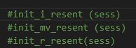

# 代码运行指令

基本环境：

ubuntu 14.06 或 16.06

tensorflow 1.3 与 tensorboard

python3.6

opencv-contrib-python (为了提取TV-L1光流)

ffmpeg


## 环境配置及准备

- 首先，参考[这份资料](https://github.com/chaoyuaw/pytorch-coviar/blob/master/GETTING_STARTED.md)完成ffmpeg的安装

- 在[此repo](https://github.com/azuxmioy/tensorflow-CoViAR)下载预处理后的HMDB-51数据集（代码基于此repo进行更改而得来）

- 初次训练时需要下载预训练[ResNet模型](https://drive.google.com/file/d/1ZGaswKgj8yKE6DAwpibl2LbuvU8-zGRH/view?usp=sharing)，并取消`i_resnet`,`r_resnet`, `mv_resnet`相关注释，用于读取预训练模型

  


## 训练

- 训练代码为`mytrain_simple.py`与`mytrain_simple_flmg.py`(两份分别为baseline与加入flmg的版本)

- 更改训练参数及配置相关路径

  

- 训练指令：

  ```bash
  CUDA_VISIBLE_DEVICES=0 python mytrain_simple.py
  ```

## 训练过程查看

命令行输出样例：

```bash
Step 200: 179.964 sec mv_loss: 39.2862 i_loss: 56.4054 r_loss: 0.0395265 fusion_loss: 7.15687 flmg_loss: 24900.8
GT: [14 29 43  2 24 42 39 40]
Pred: [14 29 24  2 24 42 39 40]
Step 210: 136.233 sec mv_loss: 51.9149 i_loss: 67.4611 r_loss: 0.477872 fusion_loss: 12.6086 flmg_loss: 25484.8
GT: [41 26 13 48 49 36 45 42]
Pred: [36 26 13 48 49  8 39 42]
Step 220: 153.871 sec mv_loss: 28.6375 i_loss: 56.5182 r_loss: 0.0124632 fusion_loss: 2.5868 flmg_loss: 24151.7
GT: [17 49 32 37 13 47 35 32]
Pred: [17 49 32 37 13 47 35 32]
```

使用tensorboard查看训练情况：

```bash
tensorboard --logdir my_logs/coviar/$YOUR FOLDER NAME$ --host 127.0.0.1 --port 1234
```

之后再浏览器查看即可


## 测试

Baseline模型：

```bash
CUDA_VISIBLE_DEVICES=0 python test.py
```

FLMG模型：

```bash
CUDA_VISIBLE_DEVICES=0 python test_flmg.py
```

